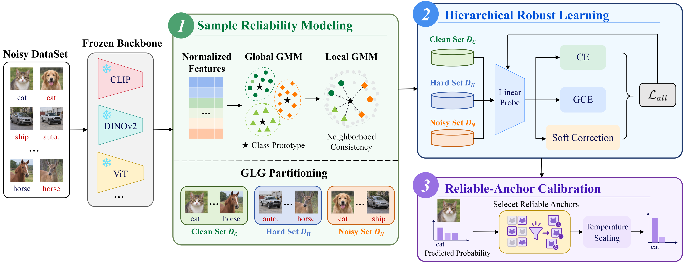

# Learning with Noisy Labels in Foundation Model Settings via Sample Reliability Modeling

Official PyTorch implementation of **FM-SRM**, a frozen-foundation-model framework for learning with noisy labels through sample reliability modeling.

## Abstract

Label noise degrades data quality and model generalization, and learning with noisy labels (LNL) aims to mitigate the impact of incorrect supervision. With the development of pretrained foundation models, their stable and discriminative representations provide a new basis for LNL. However, most existing methods rely on end-to-end training dynamics on noisy data and are difficult to adapt directly to frozen foundation models, while existing foundation-model-based methods typically use coarse sample filtering and underexploit the reliability information in pretrained features. To address these issues, we propose a sample-reliability-based LNL method for foundation models that effectively exploits frozen pretrained features for efficient sample partitioning and robust training. First, global class relationships and local neighborhood structures are jointly exploited to hierarchically partition training samples into Clean, Hard, and Noisy subsets. Second, a lightweight linear classifier applies differentiated supervision according to sample reliability for robust utilization of different samples. Meanwhile, calibration anchors are constructed from highly reliable samples to further calibrate predictive probabilities. Theoretically, the method is analyzed from the perspectives of effective supervision bias and model learning error. Experiments across various foundation models and noise settings demonstrate stable noise detection and robust classification performance, validating the effectiveness and applicability of the proposed method.

## Framework



FM-SRM has three stages:

1. **Sample reliability modeling:** frozen representations, a global prototype-margin GMM, and local neighborhood consistency partition noisy training samples into Clean, Hard, and Noisy subsets.
2. **Hierarchical robust learning:** a linear probe applies CE to Clean samples, fixed GCE (`q=0.7`) to Hard samples, and prototype-based soft correction to Noisy samples.
3. **Reliable-anchor calibration:** high-reliability Clean anchors estimate a scalar post-hoc temperature without clean training labels or test-label tuning.

## 1. Preparing the Python Environment

Create the Conda environment:

```bash
conda env create -f environment.yml
conda activate fm-srm
```

Alternatively, install the Python dependencies into an existing environment:

```bash
pip install -r requirements.txt
```

The code has been tested with Python 3.11, PyTorch 2.5.1, and CUDA 12.1.

## 2. Datasets and Pretrained Models

The synthetic-noise experiments support CIFAR-10 and CIFAR-100 with:

- Human noise
- Symmetric noise at rate 0.6
- Pairflip noise at rate 0.3
- Instance-dependent noise at rate 0.4
- Seeds 1, 2, 3, 4, and 5

The real-world experiments support Animal-10N and WebVision/ILSVRC2012. Dataset preparation is described in [docs/real_noise.md](docs/real_noise.md).

Supported frozen backbones:

| Argument | Pretraining |
| --- | --- |
| `vit_b16_imagenet` | ImageNet-supervised ViT-B/16 |
| `vit_l16_imagenet` | ImageNet-supervised ViT-L/16 |
| `dinov2_vit_b14` | DINOv2 ViT-B/14 |
| `clip_vit_b16` | OpenAI CLIP ViT-B/16 |
| `clip_vit_l14` | OpenAI CLIP ViT-L/14 |

Model weights are downloaded automatically by `timm` or `open_clip_torch`. CIFAR data is downloaded automatically under `data/` unless `data_root` is overridden.

## 3. Running FM-SRM

Run all commands from the repository root. The following example uses ImageNet-supervised ViT-B/16 on CIFAR-10.

### 3.1 Extract frozen features

```bash
python scripts/extract_features.py \
  --dataset cifar10 \
  --splits train test \
  --set backbone=vit_b16_imagenet \
  --set device=cuda:0
```

### 3.2 Stage 1: Global-Local GMM partitioning

```bash
python scripts/run_partition_generalization.py \
  --dataset cifar10 \
  --set backbone=vit_b16_imagenet \
  --set device=cuda:0
```

This command runs the four noise settings and five random seeds. The formal partition uses `tau_g=0.8`, `tau_l=0.5`, and `k=20`.

### 3.3 Stages 2 and 3: robust linear probe and calibration

```bash
python scripts/train_stage2.py \
  --dataset cifar10 \
  --set backbone=vit_b16_imagenet \
  --set device=cuda:0
```

The resulting CSV files are written under `outputs/stage2/<backbone>/<dataset>/`. Accuracy, Macro-F1, Raw ECE, temperature, and calibrated ECE are reported for each seed.

## 4. Baselines

### 4.1 Stage-1 noisy-label detection

First run FM-SRM Stage 1 for the target dataset/backbone. The baseline runners
reuse its saved noisy-label vectors so every method is evaluated on exactly the
same synthetic corruption; they do not use the FM-SRM Clean/Hard/Noisy
predictions. SimiFeat then uses the cached frozen features:

```bash
python scripts/run_simifeat.py \
  --dataset cifar10 \
  --set backbone=vit_b16_imagenet
```

CLIPCleaner is available for CLIP backbones:

```bash
python scripts/run_stage1_baseline.py \
  --method clipcleaner \
  --dataset cifar10 \
  --backbone clip_vit_b16 \
  --device cuda:0
```

### 4.2 Stage-2 robust learning

The unified frozen-feature linear-probe protocol includes CE, GCE, Co-teaching, SSR, DivideMix, DISC, and CLIPCleaner:

```bash
python scripts/run_stage2_baseline.py \
  --method ce \
  --dataset cifar10 \
  --backbone vit_b16_imagenet \
  --device cuda:0
```

Replace `ce` with `gce`, `coteaching`, `ssr`, `dividemix`, `disc`, or `clipcleaner`. A single command runs four noise settings with five seeds. CLIPCleaner requires a previously saved CLIPCleaner Stage-1 selection; it does not use the FM-SRM partition.

The paper-aligned defaults use seeds `1-5`, `tau_g=0.8`, `tau_l=0.5`, `k=20`, Hard-sample GCE `q=0.7`, prototype temperature `T_p=0.1`, anchor fraction `kappa=0.1`, and calibration target `xi=0.995`.

Baseline-specific hyperparameters are centralized in [configs/stage2_baselines.yaml](configs/stage2_baselines.yaml). Adaptation details and upstream acknowledgements are documented in [docs/baselines/README.md](docs/baselines/README.md).

## 5. Reusing Existing Feature Caches

Feature caches are intentionally excluded from Git. A cache from another checkout can be reused without copying it:

```bash
python scripts/run_partition_generalization.py \
  --dataset cifar10 \
  --settings symmetric \
  --seeds 1 \
  --set backbone=vit_b16_imagenet \
  --set features_root=/path/to/existing/features \
  --set data_root=/path/to/existing/data
```

Legacy `features/cifar10/vit_b16/` caches are automatically recognized as `vit_b16_imagenet` caches after metadata and sample-order validation.

## 6. Outputs

Generated data, features, partitions, logits, and experiment outputs are ignored by Git. The main output locations are:

```text
outputs/generalization/       # FM-SRM Stage-1 partitions and metrics
outputs/stage2/               # FM-SRM Stage-2/3 metrics and artifacts
outputs/stage2_baselines/     # Stage-2 baseline metrics
outputs/ece/                  # aggregated calibration reports
```

Build the standalone ECE report with:

```bash
python scripts/summarize_ece.py
```

## Citation

If you find this work useful, please consider citing:

```bibtex
@misc{hou2026fmsrm,
  title  = {Learning with Noisy Labels in Foundation Model Settings via Sample Reliability Modeling},
  author = {Senyu Hou and Gaoxia Jiang and Wenjian Wang},
  year   = {2026},
  note   = {Code available at https://github.com/SenyuHou/FM-SRM}
}
```

## Acknowledgements

This repository provides unified frozen-feature reproductions or adaptations of SimiFeat, CLIPCleaner, Co-teaching, SSR, DivideMix, and DISC. Their original repositories and licenses are listed in [docs/baselines/README.md](docs/baselines/README.md). Please cite the corresponding papers when using those implementations.

## License

FM-SRM is released under the [MIT License](LICENSE). Vendored or adapted third-party components remain subject to their original licenses; see [THIRD_PARTY_NOTICES.md](THIRD_PARTY_NOTICES.md).
