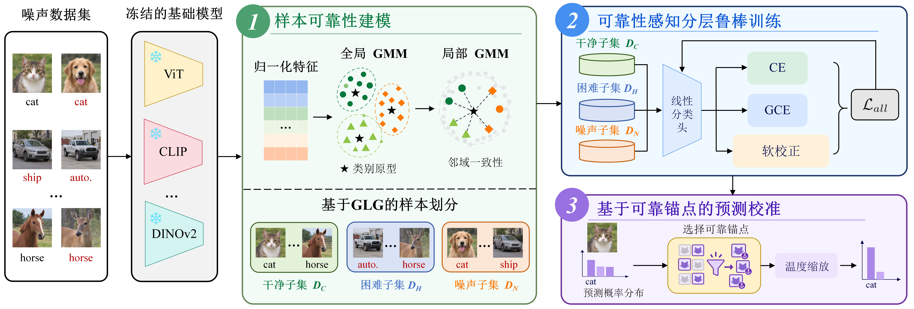

# Reliability-Aware Learning with Noisy Labels in Foundation Model Settings

Official PyTorch implementation of **FM-SRM**, a reliability-aware method for learning with noisy labels in frozen foundation model settings.

## Abstract

Label noise degrades the quality of training data for deep learning and impairs model generalization. Label-noise learning aims to mitigate the adverse effects of erroneous supervision during model training. With the rapid development of pretrained foundation models, frozen pretrained representations provide a relatively stable feature space for assessing sample reliability. However, most existing methods rely on end-to-end training with noisy data and are therefore difficult to directly adapt to scenarios with frozen foundation models. Existing foundation-model-based methods, meanwhile, often adopt relatively coarse sample selection strategies and do not fully exploit the reliability information embedded in pretrained representations. To address these limitations, we propose a reliability-aware label-noise learning method for foundation-model settings that integrates sample reliability estimation with differentiated robust learning and prediction calibration. First, in the frozen pretrained feature space, sample reliability is modeled using a global prototype margin and local neighborhood consistency, based on which the training samples are partitioned into clean, noisy, and hard subsets. Second, a lightweight linear classification head is trained with differentiated supervision according to sample reliability, enabling robust utilization of samples with different reliability levels. Meanwhile, reliable anchors are constructed from highly reliable samples to calibrate the predicted probabilities. Theoretically, we analyze the rationale of the proposed method from the perspectives of supervision bias and model learning error. Experimental results demonstrate that the proposed method achieves stable noise detection and robust classification performance across a variety of foundation models and noise settings, validating its effectiveness and applicability. The reproduction code is publicly available at [SenyuHou/FM-SRM](https://github.com/SenyuHou/FM-SRM).

## Framework



FM-SRM has three stages:

1. **Sample reliability modeling:** frozen representations, a global prototype-margin GMM, and local neighborhood consistency partition noisy training samples into Clean, Hard, and Noisy subsets.
2. **Reliability-aware hierarchical robust learning:** a linear probe applies CE to Clean samples, fixed GCE (`q=0.7`) to Hard samples, and prototype-based soft correction to Noisy samples.
3. **Prediction calibration with reliable anchors:** high-reliability Clean anchors estimate a scalar post-hoc temperature without clean training labels or test-label tuning.

## 1. Preparing the Python Environment

Create the Conda environment:

```bash
conda env create -f environment.yml
conda activate fm-srm
```

Alternatively, install the Python dependencies into an existing environment:

```bash
pip install -r requirements.txt
```

The code has been tested with Python 3.11, PyTorch 2.5.1, and CUDA 12.1.

## 2. Datasets and Pretrained Models

The synthetic-noise experiments support CIFAR-10 and CIFAR-100 with:

- Human noise
- Symmetric noise at rate 0.6
- Pairflip noise at rate 0.3
- Instance-dependent noise at rate 0.4
- Seeds 1, 2, 3, 4, and 5

The real-world experiments support Animal-10N and WebVision/ILSVRC2012 through `scripts/run_real_noise.py`.

Supported frozen backbones:

| Argument | Pretraining |
| --- | --- |
| `vit_b16_imagenet` | ImageNet-supervised ViT-B/16 |
| `vit_l16_imagenet` | ImageNet-supervised ViT-L/16 |
| `dinov2_vit_b14` | DINOv2 ViT-B/14 |
| `clip_vit_b16` | OpenAI CLIP ViT-B/16 |
| `clip_vit_l14` | OpenAI CLIP ViT-L/14 |

Model weights are downloaded automatically by `timm` or `open_clip_torch`. CIFAR data is downloaded automatically under `data/` unless `data_root` is overridden.

## 3. Running FM-SRM

Run all commands from the repository root. The following example uses ImageNet-supervised ViT-B/16 on CIFAR-10.

### 3.1 Extract frozen features

```bash
python scripts/extract_features.py \
  --dataset cifar10 \
  --splits train test \
  --set backbone=vit_b16_imagenet \
  --set device=cuda:0
```

### 3.2 Stage 1: Global-Local GMM partitioning

```bash
python scripts/run_partition_generalization.py \
  --dataset cifar10 \
  --set backbone=vit_b16_imagenet \
  --set device=cuda:0
```

This command runs the four noise settings and five random seeds. The formal partition uses `tau_g=0.8`, `tau_l=0.5`, and `k=20`.

### 3.3 Stages 2 and 3: robust linear probe and calibration

```bash
python scripts/train_stage2.py \
  --dataset cifar10 \
  --set backbone=vit_b16_imagenet \
  --set device=cuda:0
```

The resulting CSV files are written under `outputs/stage2/<backbone>/<dataset>/`. Accuracy, Macro-F1, Raw ECE, temperature, and calibrated ECE are reported for each seed.

## 4. Method Defaults

The paper-aligned defaults use seeds `1-5`, `tau_g=0.8`, `tau_l=0.5`, `k=20`, Hard-sample GCE `q=0.7`, prototype temperature `T_p=0.1`, anchor fraction `kappa=0.1`, and calibration target `xi=0.995`.

## 5. Reusing Existing Feature Caches

Feature caches are intentionally excluded from Git. A cache from another checkout can be reused without copying it:

```bash
python scripts/run_partition_generalization.py \
  --dataset cifar10 \
  --settings symmetric \
  --seeds 1 \
  --set backbone=vit_b16_imagenet \
  --set features_root=/path/to/existing/features \
  --set data_root=/path/to/existing/data
```

Legacy `features/cifar10/vit_b16/` caches are automatically recognized as `vit_b16_imagenet` caches after metadata and sample-order validation.

## 6. Outputs

Generated data, features, partitions, logits, and experiment outputs are ignored by Git. The main output locations are:

```text
outputs/generalization/       # FM-SRM Stage-1 partitions and metrics
outputs/stage2/               # FM-SRM Stage-2/3 metrics and artifacts
```

## Citation

If you find this work useful, please consider citing:

```bibtex
@misc{hou2026fmsrm,
  title  = {Reliability-Aware Learning with Noisy Labels in Foundation Model Settings},
  author = {Senyu Hou and Gaoxia Jiang and Wenjian Wang},
  year   = {2026},
  note   = {Code available at https://github.com/SenyuHou/FM-SRM}
}
```

## License

FM-SRM is released under the [MIT License](LICENSE).
